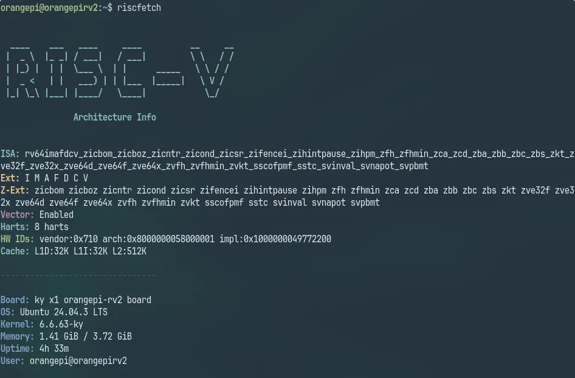

# riscfetch

[](https://github.com/kako-jun/riscfetch/actions/workflows/ci.yml)
[](https://crates.io/crates/riscfetch)
[](https://docs.rs/riscfetch-core)
[](https://opensource.org/licenses/MIT)

[English](README.md) | [中文](README.zh-CN.md) | [日本語](README.ja.md)

RISC-V システム情報ツール。ISA 拡張、hart 数、ハードウェア ID などを表示します。

**RISC-V 専用。** 他のアーキテクチャでは終了します。



## なぜ RISC-V？

世界中のアニメ、映画、食べ物が好きです。クールな技術と未来が好きなだけ。RISC-V は触っていて楽しいので、neofetch 風のツールが欲しくなりました。

## インストール

### crates.io から

```bash
cargo install riscfetch
```

### GitHub Releases から

```bash
# 最新リリースをダウンロード
curl -LO https://github.com/kako-jun/riscfetch/releases/latest/download/riscfetch-linux-riscv64

# 実行権限を付与
chmod +x riscfetch-linux-riscv64

# PATH に移動
sudo mv riscfetch-linux-riscv64 /usr/local/bin/riscfetch
```

## 使い方

```bash
riscfetch              # 標準出力
riscfetch -e           # 各 ISA 拡張の説明を表示
riscfetch -j           # JSON 出力
riscfetch -s           # アニメーション付きスプラッシュ
riscfetch -b           # ベンチマーク実行
```

## 出力例

```
ISA:    rv64imafdcv_zicsr_zifencei_zba_zbb_zbs
Ext:    I M A F D C V
Z-Ext:  zicsr zifencei zba zbb zbs
Vector: Enabled, VLEN>=128
Harts:  4 harts
HW IDs: vendor:0x489 arch:0x8000000000000007 impl:0x0
Cache:  L1D:32K L1I:32K L2:2048K

--------------------------------

Board:  StarFive VisionFive 2
OS:     Ubuntu 24.04 LTS
Kernel: 6.8.0-riscv64
Memory: 3.45 GiB / 8.00 GiB
Uptime: 3h 42m
User:   user@visionfive2
```

## オプション

| フラグ | 説明 |
|--------|------|
| `-e, --explain` | 各拡張の意味を表示 |
| `-j, --json` | 機械可読な JSON 出力 |
| `-s, --splash` | アニメーション付きスプラッシュ |
| `-b, --benchmark` | ISA 固有のベンチマーク |
| `-l, --logo <VENDOR>` | ベンダーロゴ（下記参照） |
| `--style <STYLE>` | ロゴスタイル: normal, small, none |

### 対応ベンダー

| ベンダー | 説明 |
|----------|------|
| `default` | 汎用 RISC-V ロゴ |
| `sifive` | SiFive (HiFive Unmatched, Unleashed) |
| `starfive` | StarFive (VisionFive 2) |
| `kendryte` | Kendryte/Canaan (K210, K510) |
| `allwinner` | Allwinner (D1) |
| `espressif` | Espressif (ESP32-C3, C6) |
| `spacemit` | SpacemiT (K1, Orange Pi RV2) |
| `thead` | T-Head/Alibaba (XuanTie C906, C910) |
| `milkv` | Milk-V (Duo, Mars, Pioneer) |
| `sipeed` | Sipeed (Lichee, Maix シリーズ) |
| `sophgo` | Sophgo (CV1800B, SG2000) |

## fastfetch との併用

riscfetch は RISC-V 固有の情報を表示します。完全なシステム情報には fastfetch と併用してください。

## コントリビューション

Issue や Pull Request を歓迎します！

- バグ報告
- 機能リクエスト
- 新しい RISC-V ボードのサポート
- ドキュメントの改善

### テスト協力募集

テスト用ハードウェアが限られています。以下の環境でテストできる方は、結果を報告してください（動作・非動作問わず）：

- **RV32E**（16 レジスタ組み込み向け）- 例: ESP32-C3, CH32V003
- **Vector 非対応 CPU** - 例: VisionFive 2, Allwinner D1
- **異なる VLEN 値** - VLEN=128, 512, 1024 など
- **特殊な Z 拡張** - Zk（暗号）, Zcmp, Zacas など

「動きました」という報告だけでも価値があります！Issue で `/proc/cpuinfo` と riscfetch の出力を共有してください。

## ライセンス

MIT
